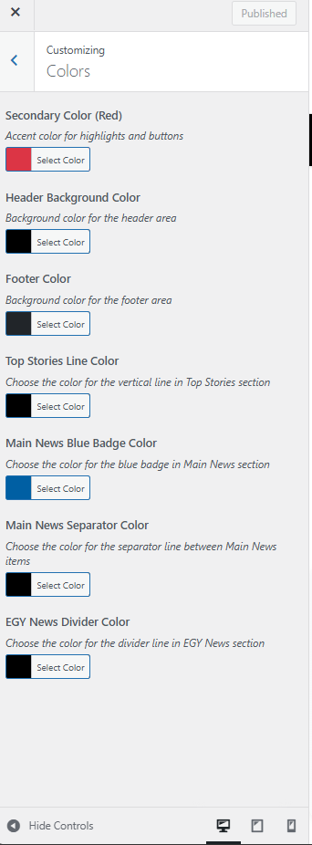
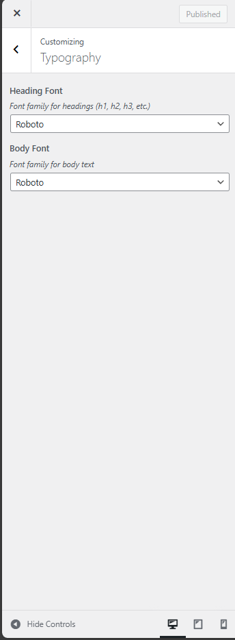
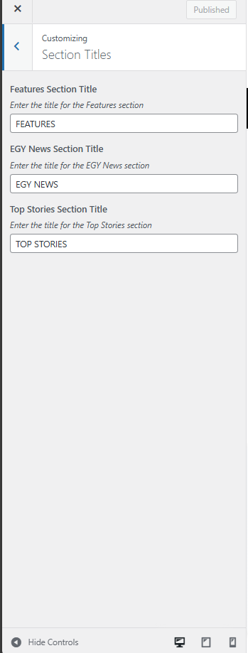
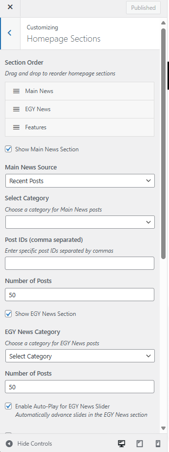
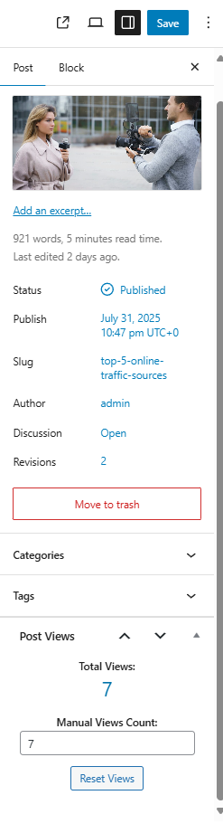
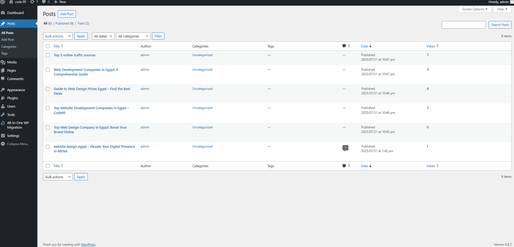

# Code95 Task WordPress Theme

## ✨ **Complete Feature **

### 🏠 **Homepage Features**
- **Dynamic Section Ordering** - Drag & drop section reordering
- **Main News Section** - Featured posts with large layout
- **EGY News Section** - Horizontal touch-enabled slider
- **Features Section** - Grid layout with top stories sidebar
- **Individual Section Toggles** - Enable/disable any section
- **Custom Section Titles** - Editable section headings
- **Content Source Options** - Recent posts, categories, or specific posts

### 🎨 **Design & Styling**
- **Bootstrap 5 Framework** - Modern responsive design
- **Custom Color Scheme** - Primary, secondary, header, footer colors
- **Typography Control** - Google Fonts integration (Roboto, Cairo, Montserrat, Arial, Georgia)
- **Modern Shadows & Animations** - Page load effects and hover animations
- **Responsive Design** - Mobile-first approach
- **RTL Support** - Right-to-left language support

### 📱 **Header Features**
- **Sticky Header** - Optional sticky navigation
- **Top Header Image** - Customizable banner image (813x98px)
- **Search Functionality** - Integrated search bar
- **Mobile Offcanvas Menu** - Touch-friendly mobile navigation

### 📊 **Content Management**
- **Post Views System** - Track and display view counts
- **Popular Posts Widget** - Sidebar widget showing most viewed
- **Category Management** - Easy category-based content organization
- **Tag Cloud** - Dynamic tag display
- **Custom Excerpts** - Controlled excerpt lengths
- **Featured Images** - Multiple image sizes (featured, thumbnail, small)

### 🎬 **Interactive Features**
- **Infinite Slider** - EGY News horizontal slider with touch support
- **Auto-Play Controls** - Configurable slider timing
- **Pause on Hover** - User-friendly slider controls
- **Touch Support** - Mobile-friendly interactions
- **Smooth Animations** - CSS transitions and transforms

### 📄 **Single Post Features**
- **Modern Post Layout** - Clean, readable design
- **Social Sharing** - Built-in share buttons
- **Author Box** - Author information display
- **Related Posts** - Automatic related content
- **Post Navigation** - Previous/next post links
- **Comments System** - Styled comment section
- **Tag Display** - Post tags with links

### 🎛️ **Customizer Controls**
- **Live Preview** - Real-time changes
- **Color Picker** - Easy color selection
- **Font Selection** - Dropdown font choices
- **Section Ordering** - Drag & drop interface
- **Content Source** - Category, recent, or specific posts
- **Slider Settings** - Auto-play configuration
- **Header Options** - Sticky and image controls
- **Footer Customization** - Custom footer text

### 🔧 **Technical Features**
- **WordPress Standards** - Full WordPress compliance
- **SEO Optimized** - Clean, semantic HTML
- **Performance Optimized** - Efficient CSS and JavaScript
- **Cross-Browser Compatible** - Works on all modern browsers
- **Accessibility Ready** - WCAG compliant
- **Translation Ready** - Internationalization support

---

## 📥 **Installation & Setup**

### **Step 1: Install the Theme**

1. Go to **WordPress Admin** → **Appearance** → **Themes**
2. Click **"Add New"**
3. Click **"Upload Theme"**
4. Upload the `code95.zip` file
5. Click **"Install Now"**
6. Click **"Activate"**

### **Step 2: Import Demo Content**

#### **Method 1: WordPress Import (Recommended)**

1. Go to **WordPress Admin** → **Tools** → **Import**
2. Click **"WordPress"** (install if not available)
3. Click **"Run Importer"**
4. Upload the `demo-content/code95.WordPress.2025-08-02.xml` file
5. Click **"Upload file and import"**
6. Map authors to existing users or create new ones
7. Click **"Submit"**

#### **Method 2: All-in-One WP Migration Plugin**

1. **Install Plugin:**
   - Go to **WordPress Admin** → **Plugins** → **Add New**
   - Search for **"All-in-One WP Migration"**
   - Click **"Install Now"**
   - Click **"Activate"**

2. **Import Site:**
   - Go to **WordPress Admin** → **All-in-One WP Migration** → **Import**
   - Click **"Import from"** → **"File"**
   - Upload the `.wpress` file (if available)
   - Click **"Import"**
   - Wait for the import to complete

### **⚠️ IMPORTANT: Backup Data Login Credentials**

If you use the backup data (All-in-One WP Migration method), you can log in with these credentials:

- **Username**: `admin`
- **Password**: `admin`

---

## 🎛️ **Customizer Guide**

The Code95 theme provides extensive customization options through the WordPress Customizer. Here's a complete guide to all available settings:

### **Accessing the Customizer**

1. Go to **WordPress Admin** → **Appearance** → **Customize**
2. Or click **"Customize"** in the admin bar when viewing your site


---

## 🎨 **Colors Section**



### **Primary Color**
- **Setting**: Primary Color (Blue)
- **Default**: `#005fa3`
- **Usage**: Main theme color for links, buttons, and highlights
- **Location**: Customizer → Colors → Primary Color


### **Secondary Color**
- **Setting**: Secondary Color (Red)
- **Default**: `#dc3545`
- **Usage**: Accent color for highlights and buttons
- **Location**: Customizer → Colors → Secondary Color


### **Header Background Color**
- **Setting**: Header Background Color
- **Default**: `#000000` (Black)
- **Usage**: Background color for the header area
- **Location**: Customizer → Colors → Header Background Color


### **Footer Color**
- **Setting**: Footer Color
- **Default**: `#212529` (Dark Gray)
- **Usage**: Background color for the footer area
- **Location**: Customizer → Colors → Footer Color


### **Top Stories Line Color**
- **Setting**: Top Stories Line Color
- **Default**: `#000000` (Black)
- **Usage**: Color for the vertical line in Top Stories section
- **Location**: Customizer → Colors → Top Stories Line Color


### **Main News Blue Badge Color**
- **Setting**: Main News Blue Badge Color
- **Default**: `#005fa3` (Blue)
- **Usage**: Color for blue badges in Main News section
- **Location**: Customizer → Colors → Main News Blue Badge Color


### **Main News Separator Color**
- **Setting**: Main News Separator Color
- **Default**: `#000000` (Black)
- **Usage**: Color for separator lines between Main News items
- **Location**: Customizer → Colors → Main News Separator Color


### **EGY News Divider Color**
- **Setting**: EGY News Divider Color
- **Default**: `#000000` (Black)
- **Usage**: Color for divider lines in EGY News section
- **Location**: Customizer → Colors → EGY News Divider Color


---

## 📝 **Typography Section**



### **Heading Font**
- **Setting**: Heading Font
- **Default**: Roboto
- **Options**: Roboto, Cairo, Montserrat, Arial, Georgia
- **Usage**: Font family for all headings (h1, h2, h3, etc.)
- **Location**: Customizer → Typography → Heading Font


### **Body Font**
- **Setting**: Body Font
- **Default**: Roboto
- **Options**: Roboto, Cairo, Montserrat, Arial, Georgia
- **Usage**: Font family for body text
- **Location**: Customizer → Typography → Body Font


---

## 🏷️ **Section Titles Section**



### **Features Section Title**
- **Setting**: Features Section Title
- **Default**: "FEATURES"
- **Usage**: Title displayed in the Features section
- **Location**: Customizer → Section Titles → Features Section Title


### **EGY News Section Title**
- **Setting**: EGY News Section Title
- **Default**: "EGY NEWS"
- **Usage**: Title displayed in the EGY News section
- **Location**: Customizer → Section Titles → EGY News Section Title


### **Top Stories Section Title**
- **Setting**: Top Stories Section Title
- **Default**: "TOP STORIES"
- **Usage**: Title displayed in the Top Stories section
- **Location**: Customizer → Section Titles → Top Stories Section Title


---

## 🏠 **Homepage Sections Section**



### **Section Order**
- **Setting**: Section Order
- **Default**: "main-news,egy-news,features"
- **Usage**: Drag and drop to reorder homepage sections
- **Location**: Customizer → Homepage Sections → Section Order


### **Main News Section**

#### **Show Main News Section**
- **Setting**: Show Main News Section
- **Default**: Enabled (checked)
- **Usage**: Toggle the Main News section on/off
- **Location**: Customizer → Homepage Sections → Show Main News Section


#### **Main News Source**
- **Setting**: Main News Source
- **Default**: Recent Posts
- **Options**: Recent Posts, From Category, Select Posts
- **Usage**: Choose how to populate the Main News section
- **Location**: Customizer → Homepage Sections → Main News Source


#### **Select Category**
- **Setting**: Select Category
- **Default**: None selected
- **Usage**: Choose a category for Main News posts (when "From Category" is selected)
- **Location**: Customizer → Homepage Sections → Select Category


#### **Post IDs**
- **Setting**: Post IDs (comma separated)
- **Default**: Empty
- **Usage**: Enter specific post IDs for Main News (when "Select Posts" is selected)
- **Location**: Customizer → Homepage Sections → Post IDs


#### **Number of Posts**
- **Setting**: Number of Posts
- **Default**: 4
- **Range**: 1-10
- **Usage**: Number of posts to display in Main News section
- **Location**: Customizer → Homepage Sections → Number of Posts


### **EGY News Section**

#### **Show EGY News Section**
- **Setting**: Show EGY News Section
- **Default**: Enabled (checked)
- **Usage**: Toggle the EGY News section on/off
- **Location**: Customizer → Homepage Sections → Show EGY News Section


#### **EGY News Category**
- **Setting**: EGY News Category
- **Default**: None selected
- **Usage**: Choose a category for EGY News posts
- **Location**: Customizer → Homepage Sections → EGY News Category


#### **Number of Posts**
- **Setting**: Number of Posts
- **Default**: 6
- **Range**: 1-12
- **Usage**: Number of posts to display in EGY News section
- **Location**: Customizer → Homepage Sections → Number of Posts


#### **Slider Settings**

##### **Enable Auto-Play**
- **Setting**: Enable Auto-Play for EGY News Slider
- **Default**: Enabled (checked)
- **Usage**: Automatically advance slides in the EGY News section
- **Location**: Customizer → Homepage Sections → Enable Auto-Play


##### **Pause on Hover**
- **Setting**: Pause Auto-Play on Hover
- **Default**: Enabled (checked)
- **Usage**: Pause auto-play when hovering over the EGY News slider
- **Location**: Customizer → Homepage Sections → Pause Auto-Play on Hover


##### **Auto-Play Speed**
- **Setting**: Auto-Play Speed (seconds)
- **Default**: 3
- **Range**: 1-10 (0.5 step increments)
- **Usage**: Time between automatic slide transitions
- **Location**: Customizer → Homepage Sections → Auto-Play Speed


### **Features Section**

#### **Show Features Section**
- **Setting**: Show Features Section
- **Default**: Enabled (checked)
- **Usage**: Toggle the Features section on/off
- **Location**: Customizer → Homepage Sections → Show Features Section


#### **Features Source**
- **Setting**: Features Source
- **Default**: Recent Posts
- **Options**: Recent Posts, From Category, Select Posts
- **Usage**: Choose how to populate the Features section
- **Location**: Customizer → Homepage Sections → Features Source


#### **Features Category**
- **Setting**: Features Category
- **Default**: None selected
- **Usage**: Choose a category for Features posts (when "From Category" is selected)
- **Location**: Customizer → Homepage Sections → Features Category


#### **Featured Post IDs**
- **Setting**: Featured Post IDs (comma separated)
- **Default**: Empty
- **Usage**: Enter specific post IDs for the features section (when "Select Posts" is selected)
- **Location**: Customizer → Homepage Sections → Featured Post IDs


### **Top Stories Section**

#### **Show Top Stories Section**
- **Setting**: Show Top Stories Section
- **Default**: Enabled (checked)
- **Usage**: Toggle the Top Stories section on/off
- **Location**: Customizer → Homepage Sections → Show Top Stories Section


#### **Number of Top Stories**
- **Setting**: Number of Top Stories
- **Default**: 5
- **Range**: 1-10
- **Usage**: Number of top stories to display
- **Location**: Customizer → Homepage Sections → Number of Top Stories


#### **Show EGY News Separator Line**
- **Setting**: Show EGY News Separator Line
- **Default**: Enabled (checked)
- **Usage**: Display separator line after EGY News section
- **Location**: Customizer → Homepage Sections → Show EGY News Separator Line


---

## 🎯 **Header Options Section**

### **Enable Sticky Header**
- **Setting**: Enable Sticky Header
- **Default**: Enabled (checked)
- **Usage**: Make the header stick to the top when scrolling
- **Location**: Customizer → Header Options → Enable Sticky Header


---

## 🖼️ **Top Header Image Section**

### **Top Header Image**
- **Setting**: Top Header Image
- **Default**: Theme default image
- **Usage**: Upload or select the top header image (Recommended: 813x98px)
- **Location**: Customizer → Top Header Image → Top Header Image


### **Image Alt Text**
- **Setting**: Image Alt Text
- **Default**: "Top Header Image"
- **Usage**: Enter alt text for accessibility
- **Location**: Customizer → Top Header Image → Image Alt Text


### **Show Top Header Image**
- **Setting**: Show Top Header Image
- **Default**: Enabled (checked)
- **Usage**: Enable or disable the top header image
- **Location**: Customizer → Top Header Image → Show Top Header Image


---

## 🦶 **Footer Options Section**

### **Footer Text**
- **Setting**: Footer Text
- **Default**: "© [Year] [Site Name]. All rights reserved."
- **Usage**: Enter the footer text. You can use HTML tags like `<strong>` for bold text
- **Location**: Customizer → Footer Options → Footer Text


---

## 🔧 **Advanced Features**

### **Post Views System**
- **Automatic Tracking** - Views are tracked automatically
- **Admin Dashboard** - View post statistics in admin
- **Popular Posts Widget** - Display most viewed posts
- **View Count Display** - Show views on posts
- **Anti-Spam Protection** - Prevents duplicate view counting






### **Menu Overflow Handler**
- **Automatic Detection** - Detects when menu items don't fit
- **Smart "More" Dropdown** - Moves overflow items to dropdown
- **Responsive Behavior** - Adapts to different screen sizes
- **Bootstrap Integration** - Uses Bootstrap dropdown functionality


### **Infinite Slider**
- **Touch Support** - Swipe gestures on mobile
- **Mouse Drag** - Click and drag on desktop
- **Auto-Play** - Configurable automatic advancement
- **Pause on Hover** - User-friendly controls
- **Smooth Transitions** - CSS-based animations


## 📄 **File Structure**

```
code95/
├── assets/
│   ├── css/
│   │   ├── style.css
│   │   ├── header.css
│   │   ├── single-post.css
│   │   └── top-header-image.css
│   ├── js/
│   │   ├── main.js
│   │   ├── customizer.js
│   │   └── menu-overflow.js
│   └── img/
├── inc/
│   ├── customizer/
│   │   ├── customizer.php
│   │   └── controls/
│   ├── enqueue.php
│   ├── post-queries.php
│   ├── post-views.php
│   └── theme-support.php
├── template-parts/
│   ├── header/
│   └── sections/
├── templates/
├── demo-content/
├── screenshots/
├── functions.php
├── header.php
├── footer.php
├── single.php
├── sidebar.php
└── style.css

```
